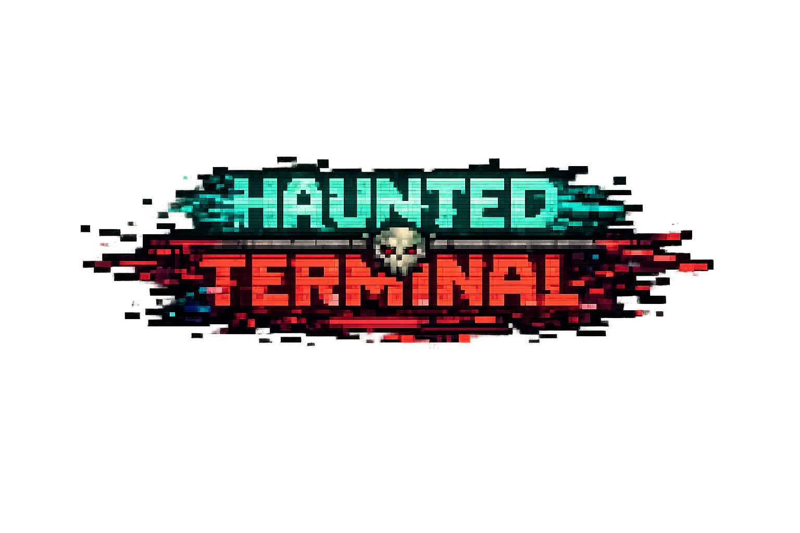
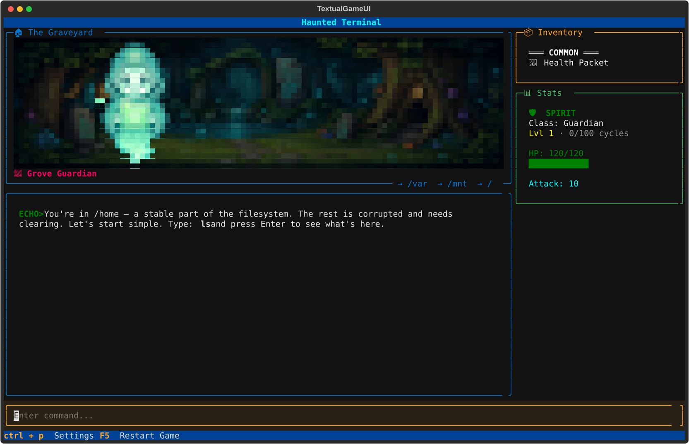
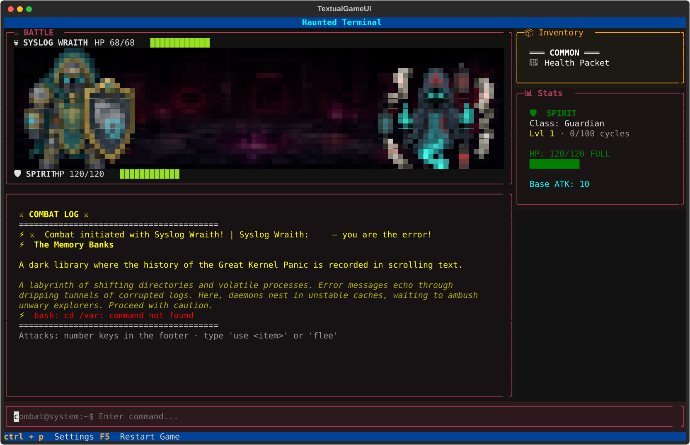
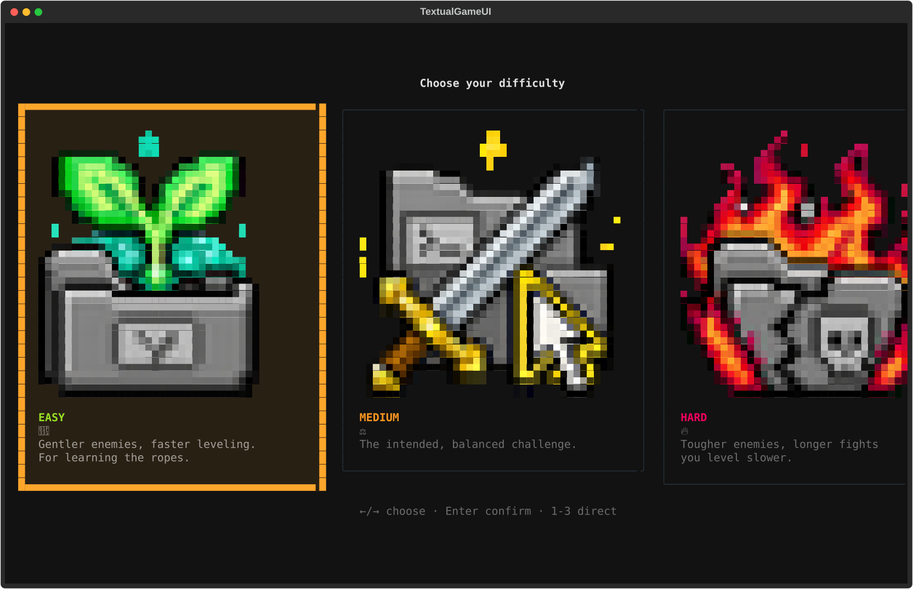

<p align="center">
  
</p>

# Haunted Terminal

You wake up in `/home` with no memory, the last surviving process after a
catastrophic system failure. The filesystem around you is corrupted and haunted
by the daemons of what went wrong. Explore it, fight what's left of it, and
piece together what happened — using real Unix commands (`ls`, `cd`, `cat`,
`pwd`) as your only tools.

The directories are real ones. `cd ..` walks up the tree, `ls -a` shows what is
hidden, and a sealed directory stays sealed until you have permission to enter
it — including permission on every directory above it. Type `man cd` and the
game tells you what `cd` does in an actual shell, not just in here.

No prior command-line experience needed; the game teaches you as you go.

---


*Exploring the Graveyard — pixel scene view, live panels, ECHO guiding your first `ls`*

| Pokemon-style battles | Pick your difficulty |
|---|---|
|  |  |

---

## Getting Started

### Step 0 — get the game and go INTO its folder

All commands below must be run **from inside the repo folder**:

```bash
git clone https://github.com/NoHudd/hauntedTerminal.git
cd hauntedTerminal
```

(Downloaded a ZIP instead? Unzip it, then `cd` into the unzipped folder.)

### Quick Start (Recommended)

From inside the repo folder, run the start script for your system:

**On Mac/Linux:**
```bash
./start.sh
```

**On Windows:**
```cmd
start.bat
```

The start script automatically checks for Python, creates a virtual
environment, installs dependencies, and launches the game. **First time setup
is completely automatic.**

### Manual Installation (Alternative)

**Prerequisites**: Python 3.10+, pip

```bash
python -m venv venv
source venv/bin/activate  # On Windows: venv\Scripts\activate
pip install -r requirements.txt
python main.py
```

---

Full command list, classes, mechanics, tips, and project structure live in
**[REFERENCE.md](./REFERENCE.md)** — the game teaches all of it as you play,
so treat that as a lookup, not required reading.

---

## License

This project is licensed under the MIT License — see the LICENSE file for details.

## Acknowledgments

- Inspired by classic text adventures, Zork, and Unix philosophy
- **[Rich](https://github.com/Textualize/rich)** — terminal formatting and UI
- **[Textual](https://github.com/Textualize/textual)** — TUI framework
- **[PyYAML](https://pyyaml.org/)** — data loading
- **cowsay** — for inspiring the easter egg

## Credits

**Game Design & Development**: NoHudd
**Narrative Design**: The Great Kernel Panic storyline
**Pixel art**: AI-generated, hand-picked and resized
**Special Thanks**: To all sysadmins who've faced kernel panics

---

```
 ________________________________________
/                                        \
| The disk is clicking. Can you hear    |
| it? It sounds like teeth. 010101.     |
\                                        /
 ----------------------------------------
        \   ^__^
         \  (oo)\_______
            (__)\       )\/\
                ||----w |
                ||     ||
```

*Type `./start.sh` (Mac/Linux) or `start.bat` (Windows) to begin your journey.*
